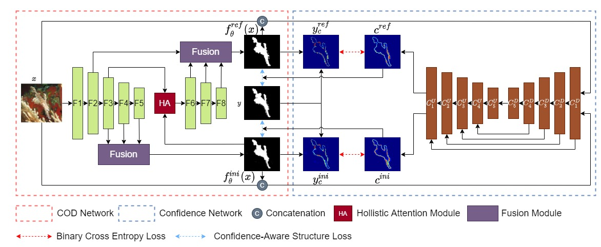

# Online Confidence Estimation - OCENet
<!-- <p align="center"></p> -->


The implementation of **Confidence-Aware Learning for Camouflaged Object Detection**, Jiawei Liu, Jing Zhang and Nick Barnes, [[Paper]](https://arxiv.org/abs/2106.11641).

## Citation
If you find the code useful, please consider citing our paper using the following BibTeX entry.
```
@article{liu2021confidence,
  title={Confidence-Aware Learning for Camouflaged Object Detection},
  author={Liu, Jiawei and Zhang, Jing and Barnes, Nick},
  journal={arXiv preprint arXiv:2106.11641},
  year={2021}
}
```

## Requirements
- Python 3.6
- pytorch 1.3.0, torchvision 0.4.1
- CUDA 10.1
- 2 x 2080Ti GPU


Download COD10K training set through [Google Drive link](https://drive.google.com/file/d/1D9bf1KeeCJsxxri6d2qAC7z6O1X_fxpt/view?usp=sharing) or [Baidu Pan link](https://pan.baidu.com/s/1XL6OjpDF-MVnXOY6-bdaBg) with the fetch code:djq2.


## Usage
1. Training
```
CUDA_VISIBLE_DEVICES=0,1 python-m torch.distributed.launch --nproc_per_node=2 --master_port=3000 train.py
```

2. Inference
```
CUDA_VISIBLE_DEVICES=0 python test.py
```

3. Evaluation

Please use the [SOD evaluation toolbox](https://github.com/jiwei0921/Saliency-Evaluation-Toolbox.git) provided by [jiwei0921](https://github.com/jiwei0921).
